<div align="center">
  
</div>

<div align="center">


</div>

---

## Índice

1. [Introducción](#1-introducción)
2. [Datos de los estudiantes](#2-datos-de-los-estudiantes)
3. [Arquitectura de la solución](#3-arquitectura-de-la-solución)
4. [Gestión de identidad — IAM](#4-gestión-de-identidad--iam)
5. [Grupos de seguridad](#5-grupos-de-seguridad)
6. [Almacenamiento S3](#6-almacenamiento-s3)
7. [Base de datos — Amazon RDS](#7-base-de-datos--amazon-rds)
8. [Instancia EC2 No. 1 — Node.js](#8-instancia-ec2-no-1--nodejs)
9. [Instancia EC2 No. 2 — Python](#9-instancia-ec2-no-2--python)
10. [Balanceador de carga y alta disponibilidad](#10-balanceador-de-carga-y-alta-disponibilidad)
11. [Aplicación web](#11-aplicación-web)
12. [Conclusiones](#12-conclusiones)
13. [Anexos](#13-anexos)

---

## 1. Introducción

**Cloud Cinema** es una plataforma web de catálogo cinematográfico que permite a un usuario
registrarse, explorar una cartelera de películas y gestionar su propia lista de reproducción.
El objetivo real de la práctica, sin embargo, no es la aplicación en sí: es **la infraestructura
que la sostiene**.

Toda la solución está desplegada en Amazon Web Services y está construida sobre una premisa
concreta: **el servicio no debe interrumpirse aunque uno de los servidores se apague**. Para
lograrlo, la aplicación no vive en una sola máquina, sino en dos instancias EC2 independientes
—una con un backend en Node.js y otra con uno en Python— situadas en **zonas de disponibilidad
distintas** y colocadas detrás de un **Application Load Balancer** que reparte el tráfico entre
ambas y retira automáticamente de rotación a la que deje de responder.

Alrededor de ese núcleo se articulan el resto de los servicios:

- **S3** aloja el frontend como sitio estático y guarda las imágenes (fotos de perfil y pósters).
- **RDS** concentra los datos en una única base relacional externa a las instancias, de modo que
  ambos backends vean exactamente la misma información.
- **IAM** define un usuario por servicio, cada uno con permisos acotados a los recursos del grupo.
- **Los grupos de seguridad** encadenan el acceso de forma que cada componente solo acepta
  tráfico del componente anterior, y la base de datos nunca queda expuesta a internet.

Este documento describe **cómo se configuró cada uno de esos servicios y por qué**, con las
capturas de pantalla que evidencian la configuración real en la cuenta de AWS.

### 1.1 Dónde encontrar cada requisito

| Requisito de la rúbrica | Sección | Responsable |
|---|---|---|
| Gestión de Identidad (IAM) | [4](#4-gestión-de-identidad--iam) | Valery |
| Configuración de S3 | [6](#6-almacenamiento-s3) | Daniel |
| Instancia EC2 No. 1 (Node.js) | [8](#8-instancia-ec2-no-1--nodejs) | Isaac |
| Instancia EC2 No. 2 (Python) | [9](#9-instancia-ec2-no-2--python) | Raúl |
| Amazon RDS | [7](#7-base-de-datos--amazon-rds) | Daniel |
| Grupos de seguridad | [5](#5-grupos-de-seguridad) | Valery |
| Balanceador de carga | [10](#10-balanceador-de-carga-y-alta-disponibilidad) | Valery |
| Diagrama de arquitectura | [3](#3-arquitectura-de-la-solución) | Valery |
| Diagrama entidad-relación | [7.2](#72-diagrama-entidad-relación) | Daniel |
| Aplicación web | [11](#11-aplicación-web) | Fátima |

---

## 2. Datos de los estudiantes

| Carné | Nombre | Rol | Responsabilidad |
|---|---|---|---|
| 202300794 | Valery Alarcón | Cloud Core / Seguridad | IAM, Security Groups, Load Balancer, EC2 |
| 202300512 | Daniel Hernández | Datos y Almacenamiento | RDS, modelo E-R, buckets S3 |
| 202307546 | Isaac Loarca | Backend Node.js | EC2 #1, API Express, AWS SDK v3 |
| 202300722 | Raúl Yat | Backend Python | EC2 #2, API FastAPI, boto3 |
| 202300434 | Fátima Cerezo | Frontend Web | SPA React, hosting estático en S3 |

---

## 3. Arquitectura de la solución

### 3.1 Diagrama

PENDIENTE

### 3.2 Descripción del flujo

El usuario abre la aplicación desde el **endpoint público del bucket S3** `practica1-web-g8`,
que sirve el SPA de React como sitio web estático. Esa página no contiene lógica de negocio:
todas sus peticiones de datos salen hacia **el DNS del Application Load Balancer**, nunca hacia
la IP de una instancia concreta.

El balanceador escucha en el **puerto 80** y reparte cada petición, en round robin, entre las dos
instancias EC2 registradas en su *target group*, que escuchan en el **puerto 3000**. Cada 10
segundos consulta `GET /health` en ambas; si una falla dos veces seguidas, la marca `unhealthy`
y deja de enviarle tráfico sin que el usuario perciba interrupción.

Cualquiera de las dos instancias resuelve la petición contra los mismos recursos compartidos:
la base de datos **RDS PostgreSQL**, a la que se conectan por el puerto 5432, y el bucket
**`practica1-images-g8`**, donde suben las fotos de perfil y los pósters usando las credenciales
del usuario IAM `iam-s3-g8` (AWS SDK v3 en Node, boto3 en Python).

En la base de datos **solo se guarda la ruta relativa** de cada imagen (por ejemplo
`Fotos_Perfil/foto1.jpg`); nunca el binario ni la URL completa. El frontend arma la URL final
concatenando el endpoint público del bucket de imágenes con esa ruta.

### 3.3 Región y red

| Elemento | Valor |
|---|---|
| Cuenta de AWS | `331725318481` |
| Región | `us-east-1` (Norte de Virginia) |
| VPC | La predeterminada — `vpc-021f0a86d2f78cd4a` |
| Zonas de disponibilidad | `us-east-1a` y `us-east-1b` |

Se trabajó sobre la VPC predeterminada porque ya provee subredes públicas en varias zonas de
disponibilidad, que es precisamente el requisito del Application Load Balancer (mínimo dos
zonas). Las dos instancias EC2 se colocaron **deliberadamente en zonas distintas**: una zona de
disponibilidad es un centro de datos físicamente separado, así que ubicar ambos servidores en la
misma zona habría producido una redundancia solo aparente.

El inventario completo de recursos —IDs, endpoints y direcciones— se mantiene actualizado en
[`infra/README.md`](infra/README.md).

### 3.4 Instancias desplegadas

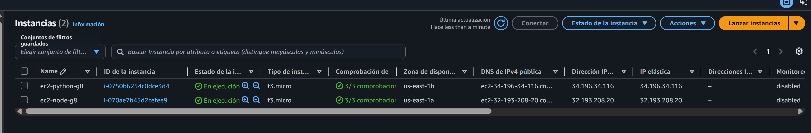
*Las dos instancias en ejecución con `3/3 comprobaciones` superadas. Obsérvese que están en
**zonas de disponibilidad distintas** (`us-east-1a` y `us-east-1b`) y que la dirección IPv4
pública coincide con la IP elástica en ambos casos, es decir, son direcciones fijas que
sobreviven al apagado y encendido de las máquinas.*

---

## 4. Gestión de identidad — IAM

> **Responsable: Valery Alarcón (R1).** Políticas versionadas en [`infra/iam/`](infra/iam/).

### 4.1 Criterio

Se creó **un usuario IAM por servicio**, cada uno con una política propia escrita a mano y
limitada a los recursos del grupo 8. No se usó ninguna política administrada por AWS del tipo
`AmazonS3FullAccess`, porque otorgan permisos sobre toda la cuenta y anulan la separación de
responsabilidades.

La cuenta raíz tiene **MFA activado** y no se utiliza para operar: todo el trabajo se realizó
con un usuario IAM administrador independiente.

### 4.2 Usuarios y políticas

| Usuario | Política | Permite | **No** permite (deliberadamente) |
|---|---|---|---|
| `iam-s3-g8` | [`policy-s3-g8.json`](infra/iam/policy-s3-g8.json) | Crear y configurar (política pública, hosting estático, CORS) los 2 buckets del grupo, y leer y escribir sus objetos | `DeleteBucket`; cualquier acción sobre otro bucket de la cuenta |
| `iam-ec2-g8` | [`policy-ec2-g8.json`](infra/iam/policy-ec2-g8.json) | Describir instancias; iniciar, detener y reiniciar **solo** las etiquetadas `Proyecto=practica1-g8` | `TerminateInstances`, `RunInstances` |
| `iam-rds-g8` | [`policy-rds-g8.json`](infra/iam/policy-rds-g8.json) | Crear, describir, iniciar, detener, modificar y respaldar únicamente `practica1-db-g8` | `DeleteDBInstance`; cualquier otra base de datos |
| `iam-elb-g8` | [`policy-elb-g8.json`](infra/iam/policy-elb-g8.json) | Crear y gestionar balanceador, target groups y listeners | Borrar el balanceador; cualquier acción fuera de ELB |

### 4.3 Decisiones de diseño de las políticas

**Alcance del usuario de S3.** `policy-s3-g8` cubre el ciclo completo de los dos buckets del
grupo: su creación, su configuración (política pública, hosting estático, CORS) y la lectura y
escritura de objetos. Omite `s3:DeleteBucket` y no alcanza ningún otro bucket de la cuenta. Esto
permite que un único usuario de servicio cubra todas las necesidades relacionadas con S3 —carga de
imágenes desde los backends y publicación del frontend— sin recurrir a políticas administradas por
AWS de alcance general.

**Restricción por etiqueta.** `policy-ec2-g8` no enumera IDs de instancia: usa una condición
`ec2:ResourceTag/Proyecto = practica1-g8`. Así el permiso sigue funcionando si se relanza una
máquina, pero nunca alcanza instancias ajenas al proyecto.

**Acciones que no admiten restricción por recurso.** Las llamadas `ec2:Describe*` y
`s3:ListAllMyBuckets` están declaradas sobre `"Resource": "*"` porque la API de AWS no permite
acotarlas — es una limitación del servicio, no una omisión. Son acciones de solo lectura: ver el
nombre de un recurso no da acceso a su contenido.

**IAM no autoriza consultas SQL.** `policy-rds-g8` controla el ciclo de vida de la instancia de
base de datos (crearla, encenderla, apagarla, respaldarla). El `SELECT` y el `INSERT` se
autentican con usuario y contraseña de PostgreSQL y se autorizan con sus `GRANT`. Son dos
sistemas de permisos distintos y complementarios.

**Rol vinculado al servicio.** `policy-elb-g8` incluye `iam:CreateServiceLinkedRole` acotado con
una condición **exclusivamente** al servicio `elasticloadbalancing.amazonaws.com`. Sin ese
permiso, la primera creación de un ALB en la cuenta falla; sin la condición, sería un permiso
excesivamente amplio.

### 4.4 Evidencia

#### Estado de seguridad de la cuenta

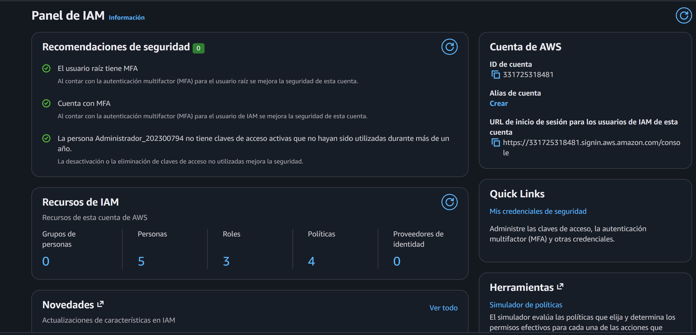
*Panel de IAM con **«Recomendaciones de seguridad: 0»**: la cuenta raíz tiene MFA activado y no
conserva claves de acceso. Toda la operación se realizó con un usuario IAM administrador, nunca
con la cuenta raíz.*

#### Usuarios

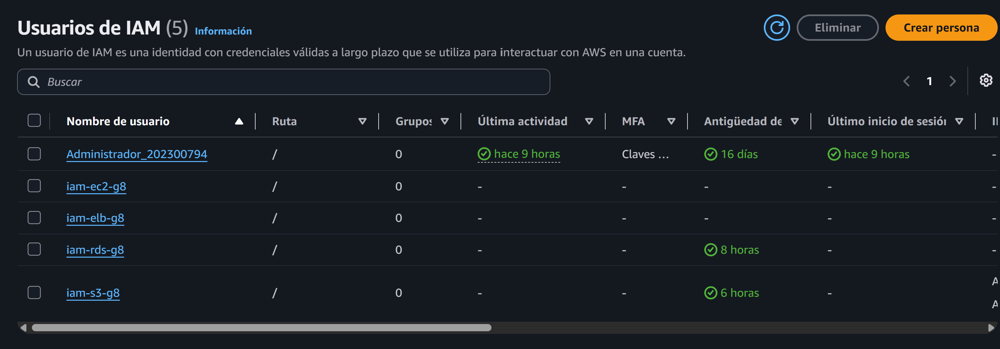
*Los cuatro usuarios de servicio del proyecto —`iam-s3-g8`, `iam-ec2-g8`, `iam-rds-g8` e
`iam-elb-g8`— junto al usuario administrador utilizado para la configuración.*

#### Políticas

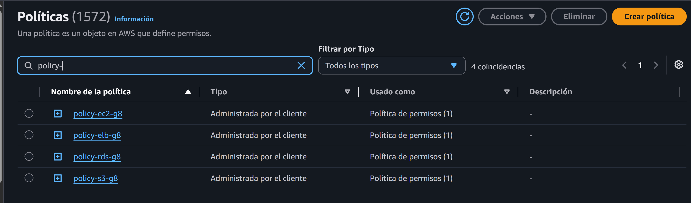
*Las cuatro políticas del grupo. Todas son de tipo **«Administrada por el cliente»** —escritas
para esta práctica, no reutilizadas de las que AWS precarga— y la columna «Usado como» confirma
que cada una está adjuntada como **política de permisos** a un usuario.*

#### Correspondencia usuario ↔ política

Cada usuario tiene adjuntada **una sola política**, la de su servicio. Ninguno acumula permisos
que no necesita:

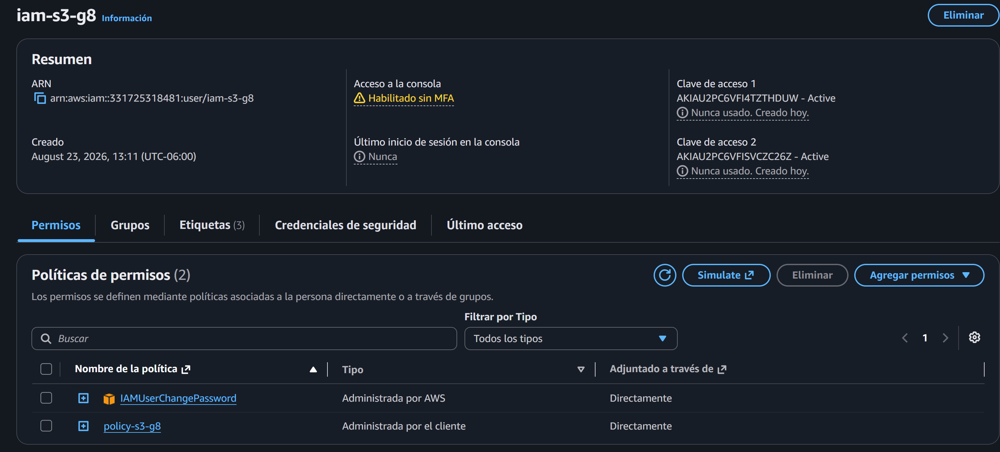
*`iam-s3-g8` → `policy-s3-g8`. Acceso a objetos limitado a los dos buckets del grupo.*

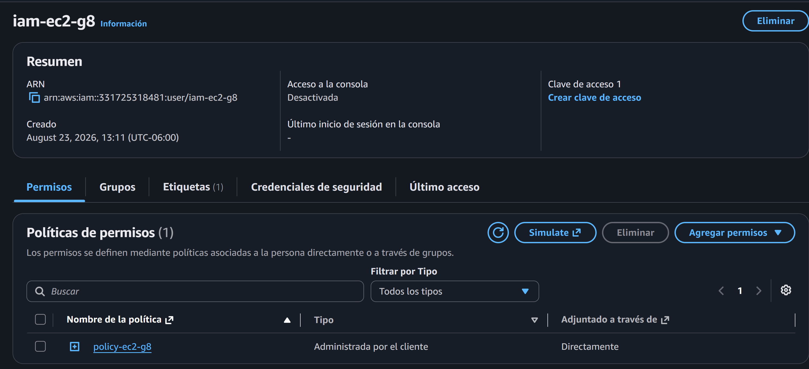
*`iam-ec2-g8` → `policy-ec2-g8`. Operación restringida por etiqueta `Proyecto=practica1-g8`.*

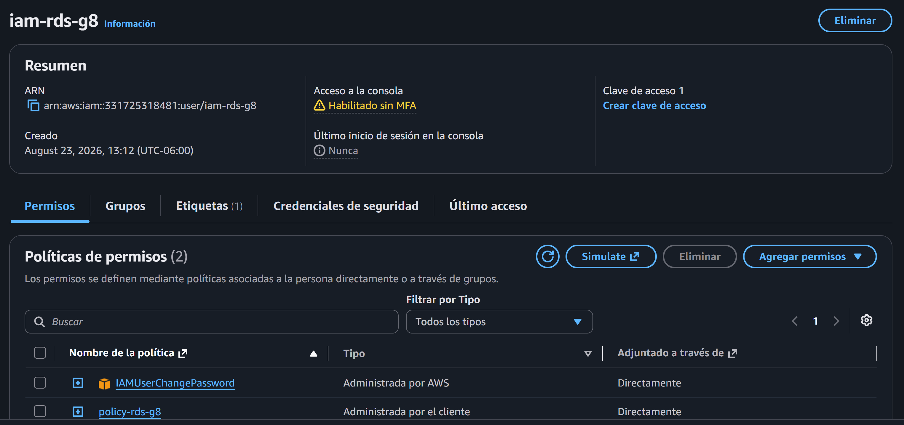
*`iam-rds-g8` → `policy-rds-g8`. Administración limitada a la instancia `practica1-db-g8`.*

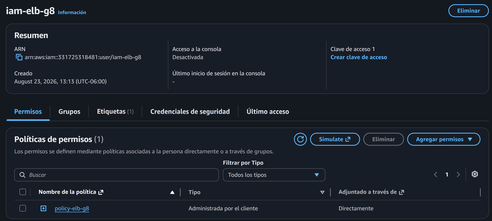
*`iam-elb-g8` → `policy-elb-g8`. Gestión del balanceador y sus target groups.*

#### Credenciales

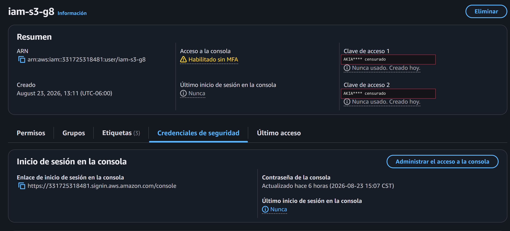
*`iam-s3-g8` con **dos claves de acceso**, una por servidor backend, de modo que si una se ve
comprometida se revoca sin dejar sin servicio al otro. Los identificadores aparecen censurados
a propósito; las claves secretas nunca se muestran ni se versionan en el repositorio.*

> **Sobre el aviso «Habilitado sin MFA»:** `iam-s3-g8` tiene acceso a consola habilitado para
> que el frontend pueda desplegarse al bucket `practica1-web-g8` mediante carga manual. Es un
> usuario de aplicación con permisos acotados a dos buckets y sin capacidad de crear, borrar ni
> modificar ningún otro recurso, por lo que se asumió el aviso de forma consciente. En un entorno
> productivo la solución correcta no sería añadirle MFA, sino sustituir las claves de larga
> duración por un **rol de IAM adjunto a cada instancia EC2**, que entrega credenciales
> temporales y rotadas automáticamente.

---

## 5. Grupos de seguridad

> **Responsable: Valery Alarcón (R1).**

### 5.1 Diseño: cadena de confianza

El principio aplicado es que **cada componente solo acepta tráfico del componente inmediatamente
anterior**. Ningún grupo permite acceso público salvo el del balanceador, que es el único punto
de entrada del sistema.

```
Internet ---80---> alb-sg-g8 ---3000---> ec2-sg-g8 ---5432---> rds-sg-g8
   (0.0.0.0/0)                (origen: alb-sg-g8)   (origen: ec2-sg-g8)

IPs del equipo ---22---> ec2-sg-g8      (SSH, solo direcciones conocidas)
```

| Security Group | ID | Puerto | Origen permitido | Justificación |
|---|---|---|---|---|
| `alb-sg-g8` | `sg-070d0cc4775f48411` | 80/tcp | `0.0.0.0/0` | Único punto de entrada público del sistema |
| `ec2-sg-g8` | `sg-003ee2b683a0fd572` | 3000/tcp | **`alb-sg-g8`** | La aplicación solo es alcanzable a través del balanceador |
| `ec2-sg-g8` | (mismo) | 22/tcp | IPs del equipo `/32` | Administración remota; nunca abierta a internet |
| `rds-sg-g8` | `sg-0c67b0cbd7676b27e` | 5432/tcp | **`ec2-sg-g8`** | La base de datos no tiene exposición pública |

### 5.2 Por qué el origen es un grupo y no una dirección IP

En las reglas de `ec2-sg-g8` y `rds-sg-g8` el origen **no es un rango de direcciones sino otro
security group**. Esto tiene dos consecuencias importantes:

1. **La regla sobrevive a los cambios de IP.** El Application Load Balancer no tiene una IP fija:
   AWS las rota. Una regla escrita contra una dirección concreta se rompería sin aviso.
2. **El acceso queda genuinamente restringido.** Aunque alguien averigüe la IP pública de una
   instancia EC2, no puede alcanzar el puerto 3000: solo el tráfico que proviene de un recurso
   con `alb-sg-g8` asociado es aceptado.

Conviene recordar además que los grupos de seguridad **solo admiten reglas de permiso** —no
existe una regla de denegación— y que son *stateful*: al permitir el tráfico de entrada, la
respuesta sale automáticamente, sin necesidad de reglas de salida adicionales.

### 5.3 Evidencia

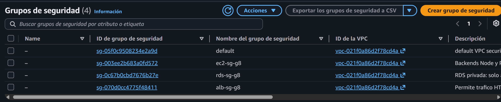
*Los tres grupos del proyecto, todos en la VPC predeterminada. El grupo `default` viene de
fábrica con la VPC y no se utiliza en esta práctica.*

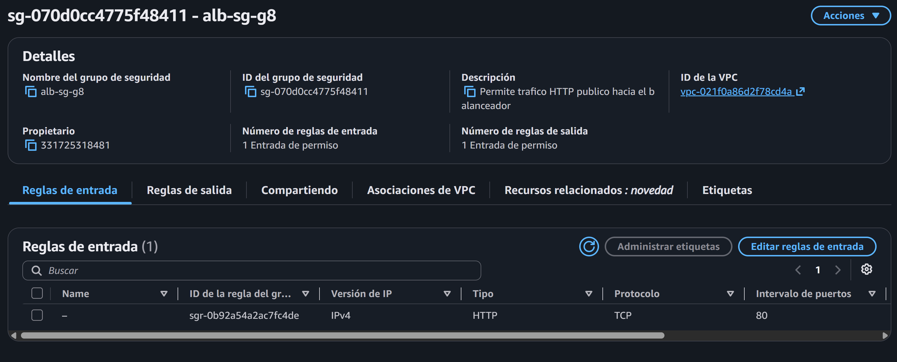
*`alb-sg-g8`: único grupo con acceso desde internet, y solo por el puerto 80.*

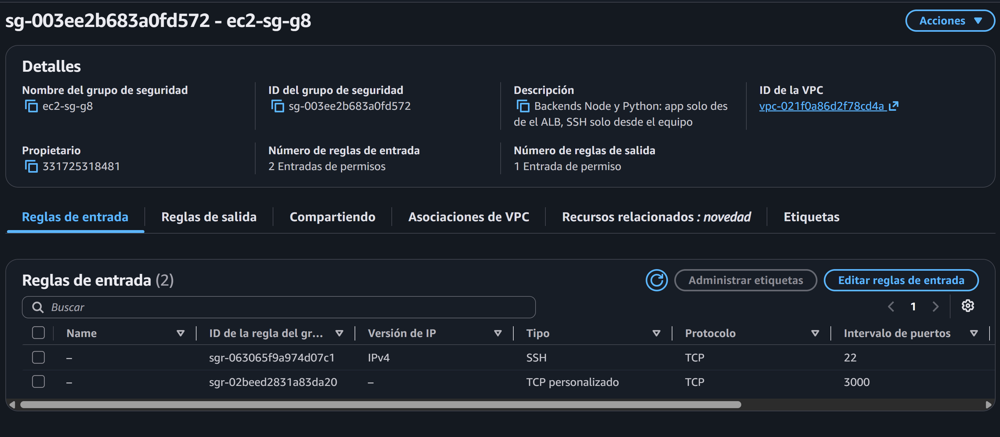
*`ec2-sg-g8`: el puerto 3000 tiene como origen el grupo del balanceador, no una dirección IP.
El puerto 22 está limitado a direcciones `/32` concretas del equipo.*

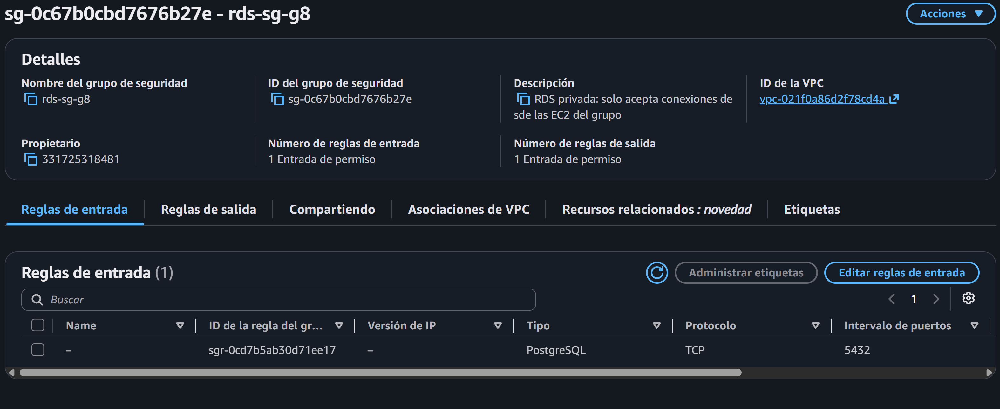
*`rds-sg-g8`: el puerto 5432 solo acepta conexiones originadas en `ec2-sg-g8`. No existe ninguna
regla con origen público.*

---

## 6. Almacenamiento S3

> **Responsable: Daniel Hernández (R2).**

_Sección pendiente._

> **Evidencia pendiente (R2):** lista de buckets, carpetas `Fotos_Perfil/` y `Fotos_Peliculas/`
> dentro del bucket de imágenes, configuración de hosting estático del bucket web, *bucket
> policy* pública y una imagen abriéndose por su URL en una ventana privada.

---

## 7. Base de datos — Amazon RDS

> **Responsable: Daniel Hernández (R2).**

### 7.1 Instancia

_Sección pendiente._

### 7.2 Diagrama entidad-relación

_Sección pendiente._

### 7.3 Esquema

_Sección pendiente. El script correspondiente es [`database/schema.sql`](database/schema.sql)._

> **Evidencia pendiente (R2):** instancia RDS activa, pestaña de conectividad mostrando
> **Acceso público = No** y el grupo de seguridad `rds-sg-g8`, y una consulta que evidencie las
> contraseñas almacenadas con MD5.

---

## 8. Instancia EC2 No. 1 — Node.js

> **Responsable: Isaac Loarca (R3).** Instancia provisionada por R1.

| Parámetro | Valor |
|---|---|
| Nombre | `ec2-node-g8` |
| ID | `i-070ae7b45d2cefee9` |
| Zona de disponibilidad | `us-east-1a` |
| Tipo | `t3.micro` (capa gratuita) |
| AMI | Amazon Linux 2023 |
| IP elástica | `32.193.208.20` |
| Security group | `ec2-sg-g8` |
| Puerto de la aplicación | 3000 |
| Runtime | Node.js v20.20.2 · npm 10.8.2 · pm2 7.0.3 |

_Descripción del despliegue pendiente (R3)._

> **Evidencia pendiente (R3):** `pm2 list` mostrando el proceso activo y
> `GET /health` respondiendo `200` desde la IP directa.

---

## 9. Instancia EC2 No. 2 — Python

> **Responsable: Raúl Yat (R4).** Instancia provisionada por R1.

| Parámetro | Valor |
|---|---|
| Nombre | `ec2-python-g8` |
| ID | `i-0750b6254c0dce3d4` |
| Zona de disponibilidad | `us-east-1b` |
| Tipo | `t3.micro` (capa gratuita) |
| AMI | Amazon Linux 2023 |
| IP elástica | `34.196.34.116` |
| Security group | `ec2-sg-g8` |
| Puerto de la aplicación | 3000 |
| Runtime | Python 3.11.15 · pip 22.3.1 |

_Descripción del despliegue pendiente (R4)._

> **Evidencia pendiente (R4):** `systemctl status` del servicio y
> `GET /health` respondiendo `200` desde la IP directa.

### 9.1 Direcciones IP elásticas

Ambas instancias tienen asociada una **IP elástica**. La dirección pública que AWS asigna por
defecto cambia cada vez que una instancia se apaga y se vuelve a encender, lo que habría roto el
acceso SSH y las pruebas directas cada vez que se apagaran las máquinas para ahorrar créditos.

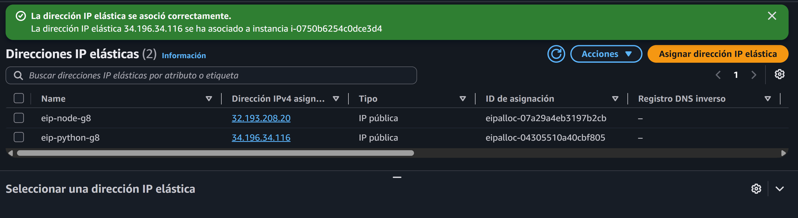
*Las dos direcciones fijas, cada una asociada a su instancia.*

---

## 10. Balanceador de carga y alta disponibilidad

> **Responsable: Valery Alarcón (R1).**

_Sección pendiente. El balanceador se configura una vez que ambos backends respondan `GET /health`._

| Recurso | Nombre | Configuración |
|---|---|---|
| Target group | `tg-cloudcinema-g8` | HTTP:3000 · health check `GET /health` · intervalo 10 s · umbrales 2/2 |
| Load balancer | `alb-cloudcinema-g8` | Internet-facing · `alb-sg-g8` · listener HTTP:80 |

> **Evidencia pendiente (R1):** ambos targets en estado `healthy`, reparto equitativo del tráfico
> entre `node` y `python`, la aplicación funcionando con una instancia detenida, y el target
> caído marcado como `unhealthy`.

---

## 11. Aplicación web

> **Responsable: Fátima Cerezo (R5).**

### 11.1 Paleta del sistema

Identidad visual de Cloud Cinema. **Estos son los valores que usa el frontend** — copiar tal cual,
no aproximar.

**Base neutra (cinematográfica)**

| Rol | Hex | Uso |
|---|---|---|
| Background | `#0D0D0F` | Fondo de la aplicación |
| Surface | `#151518` | Tarjetas, paneles |
| Elevated | `#1C1C20` | Modales, menús, elementos sobre tarjetas |
| Border | `#29292E` | Bordes y separadores |
| Text Secondary | `#98989F` | Texto de apoyo, metadatos |
| Text | `#F2F0EB` | Texto principal |

**Dorado cinematográfico — atmósfera**

| Rol | Hex | Uso |
|---|---|---|
| Soft Gold | `#E4C477` | Acentos claros, títulos destacados |
| Gold · dark | `#D6A84B` | Estados intermedios |
| Warm Gold | `#C69236` | Acento principal |
| Muted | `#A9823D` | Elementos secundarios |
| Deep | `#7D602C` | Sombras y bordes dorados |

**Rojo cereza — acción**

| Rol | Hex | Uso |
|---|---|---|
| Hover | `#CE455D` | Botón al pasar el mouse |
| Primary | `#B9344A` | Botón principal ("Agregar a mi lista") |
| Active | `#9B2A3E` | Botón presionado |
| Deep | `#7E2133` | Bordes y estados deshabilitados |
| Tint 28 % | `#B9344A` al 28 % | Fondos suaves, notificaciones |

Como variables CSS:

```css
:root {
  --bg: #0D0D0F;      --surface: #151518;   --elevated: #1C1C20;
  --border: #29292E;  --text-sec: #98989F;  --text: #F2F0EB;

  --gold-soft: #E4C477;  --gold-dark: #D6A84B;  --gold-warm: #C69236;
  --gold-muted: #A9823D; --gold-deep: #7D602C;

  --red-hover: #CE455D;  --red-primary: #B9344A;
  --red-active: #9B2A3E; --red-deep: #7E2133;
}
```

> Convención para la cartelera: el **dorado** identifica lo informativo (título, director, año,
> etiqueta «Próximo estreno») y el **rojo cereza** queda reservado para acciones que el usuario
> ejecuta (botón «Agregar a mi lista», eliminar de la lista). Así el color comunica qué se puede
> tocar y qué no.

### 11.2 Pantallas

_Sección pendiente (R5)._

> **Evidencia pendiente (R5):** registro con captura de foto por cámara, login, galería con
> pósters cargados desde S3, edición de perfil y lista de reproducción.

---

## 12. Conclusiones

_Sección pendiente de ampliar al cerrar la práctica. Conclusiones preliminares:_

1. **La alta disponibilidad no la da la redundancia por sí sola, sino el mecanismo que detecta la
   falla.** Dos servidores idénticos no aportan nada si el tráfico sigue dirigiéndose al que está
   caído. Lo que sostiene el servicio es el *health check* del balanceador: la comprobación
   periódica de `GET /health` y el retiro automático de rotación del target que deja de responder.

2. **Distribuir las instancias en zonas de disponibilidad distintas convierte una redundancia
   aparente en una real.** Alojar los dos servidores en la misma zona los expone a un único punto
   de fallo físico, por mucho que sean procesos independientes.

3. **IAM y los grupos de seguridad son capas complementarias, no alternativas.** IAM autoriza
   llamadas a la API de AWS; los grupos de seguridad filtran paquetes de red hacia un recurso.
   Un backend puede tener permiso de `s3:PutObject` y aun así no alcanzar la base de datos si el
   grupo de seguridad no lo permite.

4. **Referenciar un security group como origen, en lugar de una dirección IP, es lo que hace que
   la restricción sea efectiva y duradera.** Resiste la rotación de IPs del balanceador y cierra
   el acceso directo a las instancias desde internet.

5. **Que dos backends escritos en lenguajes distintos sean intercambiables exige un contrato de
   API acordado de antemano.** El balanceador es transparente para el frontend únicamente si
   ambas implementaciones devuelven los mismos nombres de campo y los mismos códigos de estado.

6. **El principio de mínimo privilegio se demuestra tanto con lo que una política permite como
   con lo que deliberadamente omite.** Excluir `TerminateInstances` o `DeleteDBInstance` limita
   el daño de una credencial comprometida sin estorbar la operación normal.

---

## 13. Anexos

### 13.1 Documentación complementaria

- [`infra/README.md`](infra/README.md) — inventario de recursos: IDs, endpoints, IPs y DNS
- [`infra/iam/`](infra/iam/) — las cuatro políticas IAM en JSON, versionadas
- [`docs/guides/r1-cloud-core-runbook.md`](docs/guides/r1-cloud-core-runbook.md) — procedimiento
  completo de configuración de IAM, grupos de seguridad, EC2 y balanceador
- [`docs/management/distribucion-equipo.md`](docs/management/distribucion-equipo.md) — reparto de
  trabajo, contrato de API y cronograma
- [`docs/statement/`](docs/statement/) — enunciado de la práctica

### 13.2 Notas de implementación

**Nombres de los buckets.** Los nombres de bucket de S3 **no admiten mayúsculas**. El enunciado
los escribe `Practica1-Web-G8` y `Practica1-Images-G8`; se crearon en minúsculas
(`practica1-web-g8`, `practica1-images-g8`), que es el único formato que AWS acepta.

**Nombres de los grupos de seguridad.** AWS reserva el prefijo `sg-` para los identificadores de
los grupos, de modo que no puede usarse en el nombre. Los grupos se llaman `alb-sg-g8`,
`ec2-sg-g8` y `rds-sg-g8`.

**Gestión de secretos.** Ninguna credencial está versionada en el repositorio. Las claves de
acceso, la contraseña de la base de datos y el archivo `.pem` del par de claves viven en archivos
locales ignorados por git; en el repositorio solo se incluye `.env.example`. Los identificadores
de clave de acceso aparecen censurados en las capturas.

**Control de costos.** Las instancias EC2 y la instancia RDS se detienen fuera de las horas de
trabajo. Las direcciones IP elásticas deben liberarse al finalizar la práctica: una IP elástica
sin asociar genera cargos.
