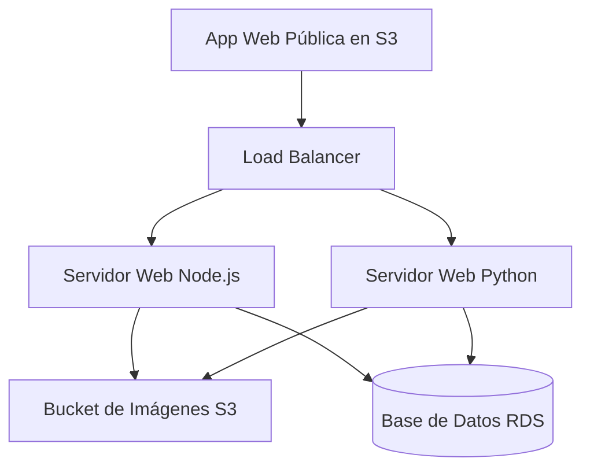

# Seminario de Sistemas 1

**Universidad de San Carlos de Guatemala**

**Facultad de Ingeniería**

**Escuela de Ciencias y Sistemas**

---

# Cloud Cinema

* **Ponderación:** 15 pts

* **Tiempo estimado:** 15 hr

---

## Índice

1. [MARCO FORMATIVO](https://www.google.com/search?q=%231-marco-formativo)

* 1.1. [Valor](https://www.google.com/search?q=%2311-valor)

* 1.2. [Competencia(s)](https://www.google.com/search?q=%2312-competencias)

* 1.3. [Objetivo SMART](https://www.google.com/search?q=%2313-objetivo-smart)

2. [Enunciado de la Práctica](https://www.google.com/search?q=%232-enunciado-de-la-pr%C3%A1ctica)

* 2.1 [Descripción de módulos](https://www.google.com/search?q=%2321-descripci%C3%B3n-de-m%C3%B3dulos)

* [IMPLEMENTACIÓN](https://www.google.com/search?q=%23implementaci%C3%B3n)

* 2.2 [Alcance de la práctica](https://www.google.com/search?q=%2322-alcance-de-la-pr%C3%A1ctica)

* 2.3 [Requerimientos técnicos](https://www.google.com/search?q=%2323-requerimientos-t%C3%A9cnicos)

* [Almacenamiento S3](https://www.google.com/search?q=%23almacenamiento-s3)

* [Bases de Datos](https://www.google.com/search?q=%23bases-de-datos)

* [Servidores](https://www.google.com/search?q=%23servidores)

* [Balanceador de Carga](https://www.google.com/search?q=%23balanceador-de-carga)

* [Página Web](https://www.google.com/search?q=%23p%C3%A1gina-web)

* [Manual Técnico](https://www.google.com/search?q=%23manual-t%C3%A9cnico)

* 2.4 [Consideraciones](https://www.google.com/search?q=%2324-consideraciones)

3. [Valores](https://www.google.com/search?q=%233-valores)

4. [Entregables](https://www.google.com/search?q=%234-entregables)

5. [Material de apoyo](https://www.google.com/search?q=%235-material-de-apoyo)

6. [Recursos y herramientas a utilizar](https://www.google.com/search?q=%236-recursos-y-herramientas-a-utilizar)

7. [Cronograma](https://www.google.com/search?q=%237-cronograma)

8. [Rúbrica de Calificación](https://www.google.com/search?q=%238-r%C3%BAbrica-de-calificaci%C3%B3n)

* 7.1 [Requisitos para optar a la calificación](https://www.google.com/search?q=%2371-requisitos-para-optar-a-la-calificaci%C3%B3n)

* 7.2 [Resumen de Puntuaciones](https://www.google.com/search?q=%2372-resumen-de-puntuaciones)

* 7.3 [Comentarios Generales](https://www.google.com/search?q=%2373-comentarios-generales)

* 7.4 [Detalle de la Calificación](https://www.google.com/search?q=%2374-detalle-de-la-calificaci%C3%B3n)

---

## 1. MARCO FORMATIVO

### 1.1. Valor

| Nombre del valor | ¿Cómo se aplica en tu laboratorio? |
| --- | --- |
| **Perseverancia** | El estudiante fortalecerá este valor al trabajar en ejercicios desafiantes, fomentando múltiples intentos y analizando errores sin desmotivarse.

 |

---

### 1.2. Competencia(s)

Indique la competencia general del curso y la competencia específica trabajada en esta lectura.

| Tipo de Competencia | Competencia |
| --- | --- |
| **Competencia General** | Aplica principios básicos de ingeniería, ciencias de computación y sistemas de información y comunicación, en la formulación y resolución adecuada de problemas complejos.

 |
| **Competencia Específica** | Capacidad para diseñar e implementar soluciones web distribuidas utilizando servicios de cómputo y balanceo de carga en la nube para garantizar la alta disponibilidad.

 |
| **Competencia Específica** | Habilidad para aplicar políticas de seguridad y control de acceso mediante la configuración de roles de identidad y reglas de firewall virtual para proteger los recursos del sistema.

 |
| **Competencia Específica** | Capacidad para integrar sistemas de almacenamiento de objetos y bases de datos relacionales en aplicaciones de múltiples lenguajes, optimizando el manejo de recursos multimedia.

 |

---

### 1.3. Objetivo SMART

| SMART | Definición | Objetivo Redactado |
| --- | --- | --- |
| **Específico (¿Qué?)** | El objetivo es concreto y tangible.

 | Implementar una arquitectura de balanceo de carga que distribuya el tráfico entre dos instancias EC2 independientes (Node.js y Python).

 |
| **Medible (¿Cuánto?)** | El objetivo tiene una medida objetiva de éxito.

 | Lograr un 100% de disponibilidad de la plataforma al realizar pruebas de apagado manual de uno de los servidores en tiempo real.

 |
| **Alcanzable (¿Cómo?)** | El objetivo debe ser posible con los recursos disponibles.

 | Configurando un Application Load Balancer y grupos de seguridad que permitan la comunicación fluida entre los servicios de cómputo.

 |
| **Realista (¿Para qué?)** | El objetivo contribuye a metas más amplias.

 | Garantizar que los usuarios de CloudCinema puedan acceder a su lista de reproducción sin interrupciones.

 |
| **A Tiempo (¿Cuándo?)** | El objetivo tiene fecha límite o mejor aún un cronograma de hitos de progreso.

 | Completar la práctica en su totalidad (servidores backend, despliegue en EC2, configuración del balanceador y publicación del HTML en S3) en un plazo máximo de 15 días.

 |

---

## 2. Enunciado de la Práctica

Una prestigiosa empresa del sector de entretenimiento multimedia planea expandir sus servicios digitales introduciendo una plataforma de catálogo de cine para un nuevo nicho de mercado interesado en el coleccionismo virtual. Para ello, lo han contratado a usted como ingeniero de soluciones en la nube para diseñar e implementar una infraestructura robusta, escalable y de alta disponibilidad utilizando Amazon Web Services (AWS). La solución debe permitir a los usuarios explorar una vasta biblioteca de títulos y gestionar su propia selección de películas favoritas, garantizando que el servicio nunca se interrumpa mediante el uso de balanceo de carga y servidores redundantes.

---

### 2.1 Descripción de módulos

Se recomienda utilizar los siguientes servicios de AWS:

* Identity and Access Management (IAM)

* Instancias EC2

* Security Groups

* Load Balancer (Balanceador de carga)

* Simple Storage Service (S3)

* Relational Database Service (RDS)

A continuación, se detallarán las diferentes secciones o funcionalidades de la aplicación web:

#### 1. Módulo de Registro

* **Correo Electrónico:** Debe ser único; el sistema validará que no existan dos cuentas con el mismo correo.

* **Nombre Completo:** Identificación personal del usuario.

* **Contraseña y Confirmación:** Se debe verificar que ambos campos coincidan antes de procesar el registro.

* **Foto de Perfil:** El usuario puede elegir un archivo de su computadora o capturarla en el momento.

* **Seguridad:** La contraseña debe ser encriptada mediante el algoritmo MD5 antes de ser almacenada.

#### 2. Módulo de Login

Sección para la autenticación de usuarios, únicamente se utilizarán las siguientes credenciales:

* **Credenciales Requeridas:** Correo electrónico y Contraseña.

* **Recomendación:** Validar formato del correo antes de permitir el intento de inicio de sesión.

#### 3. Galería de Exploración o Cartelera

Es la sección principal donde se listan las películas almacenadas en la base de datos de la plataforma.

Cada elemento de la galería debe mostrar:

* **Póster:** Imagen representativa alojada en S3.

* **Título de la película:** Nombre oficial.

* **Director:** Responsable de la obra (autor).

* **Año de Estreno:** Año de publicación original.

* **URL de Contenido:** Enlace funcional (ej. YouTube).

* **Estado:** Indicador que defina si la película está "Disponible" o es un "Próximo estreno".

**Perspectiva del usuario:**

* **Estado (Disponible):** Se habilita el botón "Agregar a mi lista de reproducción".

* **Estado (Próximo estreno):** El botón se deshabilita o se reemplaza por una etiqueta informativa.

> **NOTA:** La plataforma debe mostrar una notificación, la cual indique que la película haya sido añadida a su lista de reproducción.
> 
> 

#### 4. Edición de Perfil

Se tiene la potestad de modificar la información de su perfil, los campos que tendrá acceso a modificar son los siguientes:

* **Campos Editables:** Nombre y foto de perfil.

* **Validación:** Para guardar cualquier cambio, el sistema debe solicitar obligatoriamente la contraseña actual para verificar la identidad.

#### 5. Mi Lista de Reproducción

Aquí el usuario podrá gestionar su colección personal de películas disponibles, podrá visualizar las películas como también eliminar la película de su colección.

* **Visualización:** Lista de todas las películas que el usuario ha elegido de la galería principal.

* **Acceso al Contenido:** Al hacer clic en una película de la lista, el sistema debe redirigir al usuario a la URL de YouTube proporcionada en la ficha técnica.

* **Orden:** Se recomienda que esta sección esté organizada cronológicamente, es decir las películas que hayan sido añadidas recientemente deben ser las primeras en la lista.

---

### IMPLEMENTACIÓN

Para el desarrollo de esta aplicación web, se implementará una arquitectura como la siguiente:

---

### 2.2 Alcance de la práctica

**Obligatorio:** Dos servidores backend en instancias EC2 diferentes, tráfico correcto con la configuración de un balanceador de carga y despliegue con acceso correcto de un frontend en un bucket de S3, además de un markdown con la documentación de la configuración de cada servicio.

---

### 2.3 Requerimientos técnicos

#### Almacenamiento S3

S3 actuará tanto como servidor de archivos estáticos para la página web como repositorio de imágenes.

* **Bucket de Hosting:** Se debe crear un bucket llamado `Practica1-Web-G#` (El `#` es el número de grupo, ej. `Practica1-Web-G10`) configurado para alojar el frontend de la aplicación.

* **Bucket de Imágenes:** Se utilizará el bucket `Practica1-Images-G#` (El `#` es el número de grupo, ej. `Practica1-Images-G10`) con dos carpetas internas: `Fotos_Perfil` y `Fotos_Peliculas`.

* `Fotos_Perfil`: Todas las fotos de perfil de los usuarios serán almacenadas en esta carpeta.

* `Fotos_Peliculas`: Se almacenarán todas las fotos de las películas, independientemente de si están o no adquiridas por algún usuario.

* **Permisos de Acceso:** Todas las imágenes dentro de este bucket deben ser públicas para que puedan ser visualizadas en la galería mediante su dirección URL.

* *Sugerencia:* Configurar para permitir la acción `s3:GetObject` de forma pública con el fin de evitar tener que hacer pública cada imagen de forma manual al subirla.

#### Bases de Datos

Para la base de datos de este proyecto se utilizará el servicio de RDS.

* Se recomienda utilizar un motor relacional como MySQL o PostgreSQL para gestionar fácilmente las relaciones entre tablas.

* **Manejo de Contraseñas:** Es obligatorio que la contraseña del usuario se almacene encriptada mediante el algoritmo MD5.

* **Almacenamiento de Medios:** Está strictly prohibido guardar archivos binarios (imágenes) en la base de datos; solo se deben almacenar las URLs públicas proporcionadas por S3.

> **Ejemplo:** Si la imagen está almacenada en la carpeta `Fotos_Perfil` y el nombre de la imagen es `foto1`, entonces solo se deberá almacenar el siguiente registro: `"Fotos_Perfil/foto1.jpg"`, esto con el fin de facilitar el trabajo de convertir imágenes.
> 
> 

#### Servidores

Se deben configurar dos instancias EC2 independientes, una con el backend en Node.js y otra en Python.

* **Uso de SDK:** Ambos servidores deben utilizar el SDK de AWS oficial para interactuar con S3 (para la subida de fotos) y RDS.

* **Aislamiento:** La base de datos no debe estar instalada localmente en las instancias EC2, ambas instancias deben conectarse a la misma base de datos externa en RDS.

* **Security Groups:** Deben estar configurados para permitir tráfico únicamente en los puertos que necesiten los servidores (ej. 80, 443 o puertos personalizados como el 3000).

*Sugerencia:* Para el servidor de Python, utiliza Flask o FastAPI, y para Node.js utiliza Express. Deben asegurarse de que ambos servidores expongan los mismos endpoints (ej. `/login`, `/register`, `/playlist`) para que el balanceador trabaje de forma transparente.

#### Balanceador de Carga

Se puede configurar el balanceador de carga de diferentes formas, en esta ocasión utilizaremos el servicio de AWS Load Balancing que nos permitirá redirigir el tráfico de las peticiones a algunos de los servidores de las instancias EC2, este balanceador debe permitir lo siguiente:

* El balanceador debe estar configurado para redirigir las peticiones equitativamente entre las dos instancias EC2.

* La aplicación web debe seguir funcionando sin interrupciones si uno de los dos servidores es apagado manualmente.

#### Página Web

Puede ser realizada con cualquier librería, lenguaje o framework de programación al criterio del estudiante, esta estará alojada en un Bucket de S3 público para que se pueda acceder en cualquier momento y poder conectarse al balanceador de carga, el Bucket debe de llevar el nombre de `Practica1-Web-G#` (El `#` es el número de grupo).

#### Manual Técnico

Se necesita que se realice un manual de configuración redactado en Markdown dentro del repositorio, lo único que debe de llevar este manual es lo siguiente:

* Datos de los estudiantes.

* Descripción de la arquitectura que utilizaron (Diagrama y descripción).

* Descripción de los diferentes usuarios de IAM que se utilizaron con sus respectivas políticas.

* Diagrama de Base de Datos Entidad-Relación.

* **Capturas de Pantalla:** Buckets de S3, EC2, Base de Datos RDS en su defecto, Aplicación Web.

> Pueden realizarlo en el `README.md` del repositorio.
> 
> 

---

### 2.4 Consideraciones

1. La Página Web debe estar cargada como web estática en S3.

2. Repositorio en GitHub en modo privado y documentado con el formato Markdown.

3. Agregar como colaborador en el repositorio a los auxiliares de curso (`marckomatic` Sección B).

4. La práctica debe ser en grupos.

5. Usar los respectivos usuarios de IAM con sus respectivas políticas de acuerdo con el servicio que se está utilizando. Por ejemplo:
* Si se está utilizando S3, crear un usuario con las políticas respectivas.

* Si se está utilizando EC2, crear el usuario con las políticas para este servicio.

6. Se prohíbe modificar código o configuraciones dentro de la calificación.

7. Toda la práctica debe ser desplegada en la nube con los servicios de AWS, no se aceptará nada local.

---

## 3. Valores

En el desarrollo de la práctica, se espera que cada estudiante demuestre honestidad académica y profesionalismo. Por lo tanto, se establecen los siguientes principios:

1. **Originalidad del Trabajo:** Cada estudiante o equipo debe desarrollar su propio código y/o documentación, aplicando los conocimientos adquiridos en el curso.

2. **Prohibición de Copias y Plagio:** Si se detecta la copia total o parcial del código, documentación o cualquier otro entregable, la calificación será de **0 puntos**. Esto incluye la reproducción de código entre compañeros, la reutilización de proyectos de semestres anteriores o el uso de código externo sin la debida referencia.

3. **Uso Responsable de Recursos Externos:** El uso de bibliotecas, frameworks y ejemplos de código externos está permitido, siempre y cuando se referencien correctamente y se comprendan plenamente (Consultar con el catedrático su política).

---

## 4. Entregables

| Tipo | Descripción |
| --- | --- |
| **Repositorio en GitHub** | Repositorio con el nombre `SEMINARIO1_A_2S2026_G#` que contenga la carpeta `"Practica_1"` y dentro de la misma el código fuente de la práctica y un archivo `README.md` con la descripción y capturas de las configuraciones de los servicios.

 |
| **Código Fuente** | Código de los servidores backend (Python y JavaScript) y frontend.

 |

---

## 5. Material de apoyo

* **Subir backend NodeJS a AWS - EC2 (Oberg Agustín):**
[https://dev.to/agustinoberg/subir-backend-nodejs-a-aws-ec2-4nd5](https://www.google.com/search?q=https://dev.to/agustinoberg/subir-backend-nodejs-a-aws-ec2-4nd5)

* **Creación de un balanceador de carga (AWS):**
[https://docs.aws.amazon.com/elasticloadbalancing/latest/classic/elb-getting-started.html](https://www.google.com/search?q=https://docs.aws.amazon.com/elasticloadbalancing/latest/classic/elb-getting-started.html)

* **Configuración de un sitio web en S3 (AWS):**
[https://docs.aws.amazon.com/es_es/AmazonS3/latest/userguide/HostingWebsiteOnS3Setup.html](https://www.google.com/search?q=https://docs.aws.amazon.com/es_es/AmazonS3/latest/userguide/HostingWebsiteOnS3Setup.html)

* **Amazon RDS:**
[https://docs.aws.amazon.com/rds/](https://www.google.com/search?q=https://docs.aws.amazon.com/rds/)

[https://docs.aws.amazon.com/AmazonRDS/latest/UserGuide/](https://www.google.com/search?q=https://docs.aws.amazon.com/AmazonRDS/latest/UserGuide/)

* **AWS IAM:**
[https://docs.aws.amazon.com/iam/](https://www.google.com/search?q=https://docs.aws.amazon.com/iam/)

[https://docs.aws.amazon.com/IAM/latest/UserGuide](https://www.google.com/search?q=https://docs.aws.amazon.com/IAM/latest/UserGuide)

---

## 6. Recursos y herramientas a utilizar

* **Software:** Python y/o JavaScript.

* **Plataformas:** GitHub (para repositorio), UEDI (para entrega), AWS (para despliegue cloud).

* **Lecturas recomendadas:** Manuales de AWS, artículos sobre despliegues cloud en su concepto general o artículos sobre el uso de EC2, Load Balancer y S3.

---

## 7. Cronograma

El cronograma describe las etapas clave de la práctica, los plazos estimados para cada una, y el proceso de asignación, elaboración y calificación de las tareas. Los estudiantes deberán seguir este plan para asegurar que la práctica avance de manera organizada y cumpla con los plazos establecidos.

| Tarea | Fecha |
| --- | --- |
| **Asignación de la práctica / Entrega del enunciado** | 18/08/2026

 |
| **Fecha de entrega** | 1/09/2026

 |
| **Fecha de calificación** | 5/09/2026

 |

---

## 8. Rúbrica de Calificación

### 7.1 Requisitos para optar a la calificación

Antes de la evaluación de la práctica, los estudiantes deben cumplir con los requisitos que se indiquen en esta sección.

| Tema | Descripción | Cumple (Sí/No) |
| --- | --- | --- |
| **Cumplimiento de la tecnología establecida** | El desarrollo debe haberse realizado en Python y JavaScript, además del uso de frameworks como React o Angular.

 |  |
| **Uso de herramientas requeridas** | La aplicación debe ejecutarse completamente en la nube de AWS, no hay nada local.

 |  |
| **Gestión y entregas de práctica** | El repositorio en GitHub debe contener el código fuente y el README indicado.

 |  |

---

### 7.2 Resumen de Puntuaciones

| Área | Puntos Totales | Puntos Obtenidos |
| --- | --- | --- |
| **1. Infraestructura AWS** |  |  |
| Gestión de Identidad (IAM) | 10

 |  |
| Configuración de la instancia S3 | 7

 |  |
| Configuración de la instancia EC2 No.1 | 7

 |  |
| Configuración de la instancia EC2 No.2 | 7

 |  |
| Configuración de Amazon RDS | 10

 |  |
| Configuración de grupos de seguridad | 7

 |  |
| Configuración correcta del balanceador | 12

 |  |
| **Sub-Total Infraestructura** | **60**  |  |
| **2. Funcionalidad y Software** |  |  |
| Autenticación | 5

 |  |
| Perfil y Edición | 7

 |  |
| Galería de Exploración | 8

 |  |
| Mi Lista de Reproducción | 5

 |  |
| **Sub-Total Conocimientos** | **25**  |  |
| **3. Documentación y Conocimiento** |  |  |
| Documentación | 5

 |  |
| Preguntas | 10

 |  |
| **TOTAL** | **100**  |  |

---

### 7.3 Comentarios Generales

Toda la aplicación debe estar desplegada en la nube, todos los integrantes deben participar y en caso de sospecha de copia, el estudiante deberá demostrar su autoría en el trabajo, cualquier copia total o parcial será reportada a la escuela de sistemas.

---

### 7.4 Detalle de la Calificación

#### 1. INFRAESTRUCTURA AWS (60 pts)

* **1.1 Gestión de Identidad (IAM)** — **Punteo máximo: 10 pts**

* **Satisfactorio (10 - 6 pts):** Se implementan usuarios y roles IAM específicos por servicio con políticas que garantizan la separación de responsabilidades.

* **Necesita mejorar (5 - 0 pts):** No se utilizan usuarios IAM o las políticas aplicadas no son adecuadas para la restricción de accesos.

* **1.2 Configuración de S3** — **Punteo máximo: 7 pts**

* **Satisfactorio (7 - 4 pts):** El sitio web se despliega en S3. El bucket de imágenes contiene las carpetas `Fotos_Perfil` y `Fotos_Peliculas` con acceso público funcional.

* **Necesita mejorar (3 - 0 pts):** El acceso al sitio es deficiente o las carpetas de imágenes no cumplen con la estructura o permisos solicitados.

* **1.3 Instancia EC2 No. 1 (Node.js)** — **Punteo máximo: 7 pts**

* **Satisfactorio (7 - 4 pts):** La primera instancia cuenta con las configuraciones adecuadas para el despliegue funcional del backend en Node.js.

* **Necesita mejorar (3 - 0 pts):** No se desplegó la instancia o el servidor no se encuentra alojado correctamente en la máquina virtual.

* **1.4 Instancia EC2 No. 2 (Python)** — **Punteo máximo: 7 pts**

* **Satisfactorio (7 - 4 pts):** La segunda instancia cuenta con las configuraciones adecuadas para el despliegue funcional del backend en Python.

* **Necesita mejorar (3 - 0 pts):** No se desplegó la instancia o el servidor no responde a las peticiones del balanceador.

* **1.5 Amazon RDS y Lógica** — **Punteo máximo: 10 pts**

* **Satisfactorio (10 - 6 pts):** Base de datos RDS activa con esquema relacional funcional. Las contraseñas se almacenan encriptadas con el algoritmo MD5.

* **Necesita mejorar (5 - 0 pts):** No se utiliza RDS o las contraseñas están en texto plano. La lógica de tablas no soporta las funciones de la app.

* **1.6 Grupos de Seguridad** — **Punteo máximo: 7 pts**

* **Satisfactorio (7 - 4 pts):** Los grupos de seguridad están configurados para restringir el acceso a los puertos necesarios únicamente desde los endpoints autorizados.

* **Necesita mejorar (3 - 0 pts):** Las instancias de EC2 / RDS cuentan con configuraciones abiertas que comprometen el consumo de los servicios.

* **1.7 Balanceador de Carga** — **Punteo máximo: 12 pts**

* **Satisfactorio (12 - 7 pts):** El ALB distribuye tráfico a ambas EC2. Al detener una instancia, la aplicación sigue funcionando sin interrupción mediante el DNS del LB.

* **Necesita mejorar (6 - 0 pts):** El balanceador no cuenta con ambas instancias o el tráfico entre redes no funciona adecuadamente ante fallos.

---

#### 2. FUNCIONALIDAD Y SOFTWARE (25 pts)

* **2.1 Autenticación (Registro / Login)** — **Punteo máximo: 5 pts**

* **Satisfactorio (5 - 3 pts):** El registro por correo y el login funcionan correctamente, validando la unicidad del usuario y cargando la foto de perfil desde S3.

* **Necesita mejorar (2 - 0 pts):** Errores en el inicio de sesión o duplicidad de usuarios. La foto de perfil no se vincula dinámicamente.

* **2.2 Perfil y Edición** — **Punteo máximo: 7 pts**

* **Satisfactorio (7 - 4 pts):** Es posible visualizar la información del usuario, editar nombre y foto mediante la validación obligatoria de la contraseña actual.

* **Necesita mejorar (3 - 0 pts):** La sección de perfil es estática o no permite la edición y actualización de datos e imágenes de forma segura.

* **2.3 Galería de Exploración** — **Punteo máximo: 8 pts**

* **Satisfactorio (8 - 5 pts):** La cartelera muestra pósteres y datos técnicos (Título, Director, Año, Estado) extraídos dinámicamente de la base de datos.

* **Necesita mejorar (4 - 0 pts):** La galería no carga las imágenes de S3 o falta información técnica esencial de las obras mostradas.

* **2.4 Mi Lista de Reproducción** — **Punteo máximo: 5 pts**

* **Satisfactorio (5 - 3 pts):** Permite agregar películas "Disponibles" a la lista personal y redirige al enlace de YouTube para visualizar el contenido.

* **Necesita mejorar (2 - 0 pts):** No es posible gestionar la lista de películas favoritas o los enlaces multimedia no funcionan.

---

#### 3. DOCUMENTACIÓN Y CONOCIMIENTO (15 pts)

* **3.1 Documentación** — **Punteo máximo: 5 pts**

* **Satisfactorio (5 - 3 pts):** El repositorio cuenta con el manual técnico detallado, incluyendo diagrama de arquitectura, políticas IAM y capturas de los servicios.

* **Necesita mejorar (2 - 0 pts):** El manual no se encuentra en el repositorio o carece de las evidencias de configuración y diagramas solicitados.

* **3.2 Preguntas de Conocimiento** — **Punteo máximo: 10 pts**

* **Satisfactorio (10 - 6 pts):** Todos los integrantes demuestran dominio técnico y participación al responder preguntas sobre la infraestructura y el flujo de la práctica.

* **Necesita mejorar (5 - 0 pts):** Ninguno de los estudiantes, o solo una parte del grupo, responde adecuadamente a las preguntas técnicas sobre el proyecto.