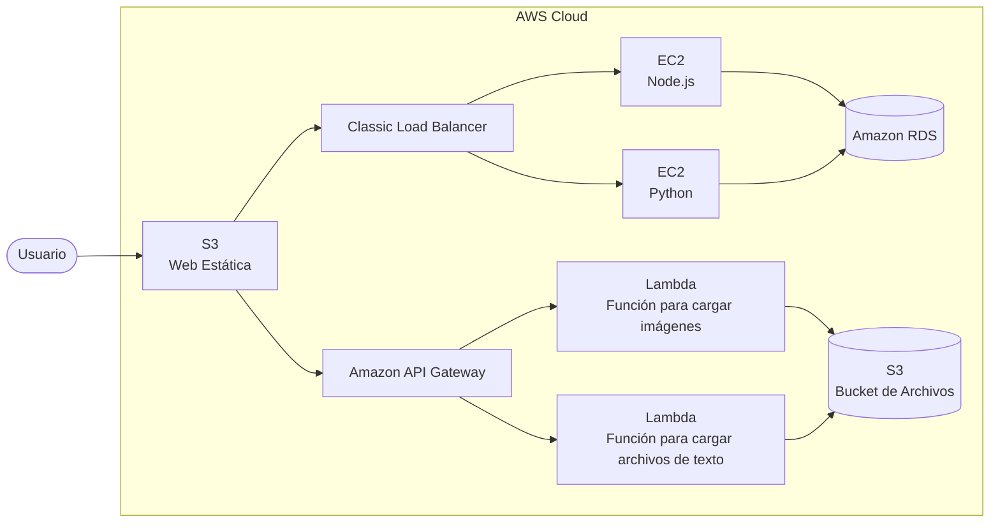
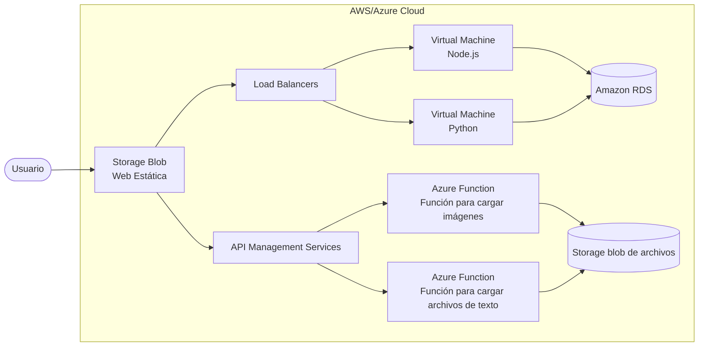

Universidad San Carlos de Guatemala
Facultad de Ingeniería
Ingeniería en Ciencias y Sistemas

# TaskFlow + CloudDrive

**PONDERACIÓN:** 15 pts
**Tiempo estimado:** 15 hr

---

## Índice

1. [Marco Formativo](#1-marco-formativo)
   - [1.1 Valor](#11-valor)
   - [1.2 Competencia(s)](#12-competencias)
   - [1.3 Objetivo SMART](#13-objetivo-smart)
2. [Enunciado de la Práctica](#2-enunciado-de-la-práctica)
   - [2.1 Descripción del problema a resolver](#21-descripción-del-problema-a-resolver)
   - [2.2 Alcance de la práctica](#22-alcance-de-la-práctica)
   - [2.3 Requerimientos técnicos - Funcionalidades Básicas](#23-requerimientos-técnicos---funcionalidades-básicas)
   - [2.4 Consideraciones de arquitectura](#24-consideraciones)
   - [2.5 Consideraciones generales](#25-consideraciones)
3. [Valores](#3-valores)
4. [Entregables](#4-entregables)
5. [Material de apoyo](#5-material-de-apoyo)
6. [Recursos y herramientas a utilizar](#6-recursos-y-herramientas-a-utilizar)
7. [Cronograma](#7-cronograma)
8. [Rúbrica de Calificación](#8-rúbrica-de-calificación)

---

## 1. Marco Formativo

### 1.1 Valor

| Nombre del valor | ¿Cómo se aplica en tu laboratorio? |
|---|---|
| Perseverancia | El estudiante fortalecerá este valor al trabajar con múltiples proveedores de nube simultáneamente, enfrentando los retos de configuración de distintos servicios, analizando errores de despliegue y persistiendo hasta lograr una solución funcional en ambas plataformas. |

### 1.2 Competencia(s)

Indique la competencia general del curso y la competencia específica trabajada en esta lectura.

| Tipo de Competencia | Descripción |
|---|---|
| Competencia General | Aplica principios básicos de ingeniería, ciencias de computación y sistemas de información y comunicación, en la formulación y resolución adecuada de problemas complejos. |
| Competencia Específica | Compara las diferencias, similitudes y complejidades entre Azure y AWS mediante el despliegue de la misma aplicación en ambas plataformas, identificando sus ventajas y limitaciones para el desarrollo de infraestructuras escalables.    Implementa servicios de cómputo (EC2, Azure VM), almacenamiento (S3, Blob Storage), bases de datos (RDS), balanceadores de carga y funciones serverless (Lambda, Azure Functions) para desplegar una aplicación completa, considerando configuración de redes, seguridad y escalabilidad. |

### 1.3 Objetivo SMART

| SMART | Definición | Objetivo Redactado |
|---|---|---|
| Específico (¿Qué?) | El objetivo es concreto y tangible. | Desarrollar una aplicación web (TaskFlow + CloudDrive) que permita gestión de tareas y almacenamiento de archivos, desplegada completamente en AWS y Microsoft Azure utilizando servicios equivalentes de cada proveedor. |
| Medible (¿Cuánto?) | El objetivo tiene una medida objetiva de éxito. | Desplegar exitosamente 2 servidores backend en EC2 y VM de Azure (uno en Node.js, uno en Python), verificando que el balanceador de carga distribuya el tráfico y que la aplicación continúe en funcionamiento aunque una instancia sea detenida. |
| Alcanzable (¿Cómo?) | El objetivo debe ser posible con los recursos disponibles. | Adquirir experiencia práctica en el despliegue multi-cloud para aplicar en proyectos profesionales futuros, comprendiendo las diferencias entre los dos proveedores más utilizados en la industria. |
| Realista (¿Para qué?) | El objetivo contribuye a metas más amplias. | Garantizar que los usuarios de CloudCinema puedan acceder a su lista de reproducción sin interrupciones. |
| A Tiempo (¿Cuándo?) | El objetivo tiene fecha límite o mejor aún un cronograma de hitos de progreso. | Completar la práctica en su totalidad (backend, frontend, base de datos, serverless, balanceadores de carga y documentación técnica) en un plazo máximo de 15 días. |

---

## 2. Enunciado de la Práctica

Amazon Web Services (AWS) y Microsoft Azure son proveedores de servicios de nube que ofrecen una gran cantidad de servicios de infraestructura que ayudan a las empresas a escalar y crecer. Con esto en mente, se desarrollará una aplicación que permita a los usuarios gestionar tareas y almacenar archivos en la nube.

**TaskFlow + CloudDrive** es una aplicación web que combina dos funcionalidades principales: **Gestión de Tareas** (los usuarios pueden crear, editar, completar y organizar tareas) y **Administrador de Archivos** (los usuarios pueden subir y visualizar distintos tipos de archivos en la nube). Los estudiantes implementarán la misma aplicación en Azure y AWS, utilizando servicios equivalentes en cada plataforma. La tarea consiste en diseñar, implementar y desplegar una arquitectura cloud completa que elimine el punto único de falla, distribuya la carga de trabajo y separe las responsabilidades.

### 2.1 Descripción del problema a resolver

La tarea consiste en diseñar, implementar y desplegar una arquitectura cloud completa que:

1. **Elimine el punto único de falla:** el backend debe estar replicado en al menos dos servidores distintos.
2. **Distribuya la carga de trabajo:** un balanceador debe dirigir el tráfico entre los servidores backend.
3. **Separe las responsabilidades:** el frontend debe ser independiente del backend y servirse de forma estática.

### 2.2 Alcance de la práctica

- **Obligatorio:** Backend en Node.js y Python sobre EC2 / VM de Azure, balanceadores de carga, frontend en S3 y Blob Storage, base de datos en RDS, funciones serverless (Lambda y Azure Functions), manual técnico en Markdown.

**Servicios requeridos — AWS:**

1. IAM
2. EC2
3. Load Balancer
4. S3
5. RDS
6. Lambda
7. API Gateway

**Servicios requeridos — Microsoft Azure:**

1. Azure VM
2. Azure Load Balancer
3. Azure Blob
4. Azure Functions
5. Azure API Management

### 2.3 Requerimientos técnicos - Funcionalidades Básicas

#### Registro de usuarios

Para el registro de usuarios nuevos se deberá llenar un formulario web con los siguientes datos:

- Nombre de usuario (único en la plataforma).
- Correo electrónico.
- Contraseña (debe almacenarse encriptada en la base de datos).
- Confirmación de la contraseña.
- Imagen de perfil.

#### Inicio de Sesión

Todo usuario podrá iniciar sesión mediante:

- Nombre de Usuario.
- Contraseña.

La pantalla de inicio tras el login puede ser la sección de tareas o archivos, a discreción del estudiante.

#### Sección de Tareas

Dentro de esta sección el usuario podrá administrar toda su lista de tareas, pudiendo crear, editar, eliminar y marcarlas como completadas.

**Crear Tareas**

El usuario podrá crear una tarea nueva completando los siguientes campos:

- Título de la tarea.
- Descripción de la tarea.
- Fecha de creación (puede generarse de forma automática o manual).

**Editar Tareas**

El usuario podrá modificar la información de cualquiera de sus tareas:

- Título de la tarea.
- Descripción de la tarea.

**Marcar Tareas Como Completadas**

El usuario en cualquier momento podrá marcar cada una de sus tareas como completadas. La forma de representar esta acción queda a discreción del estudiante.

**Eliminar Tareas**

El usuario podrá eliminar las tareas que desee, independientemente de si están completadas o no.

#### Sección de Archivos

Además de las tareas, la aplicación incluye un File Manager básico para cargar y visualizar archivos.

**Cargar Archivos**

El usuario podrá cargar cualquier tipo de archivos. Los tipos mínimos requeridos son:

- Imágenes.
- Archivos de texto.

**Listar Archivos**

El usuario podrá visualizar todos sus archivos en una sección dedicada. Se debe mostrar como mínimo el nombre y tipo de archivo.

**Visualizar Archivos**

El usuario podrá visualizar el contenido de cada archivo subido. La forma de presentación queda a discreción del estudiante.

### 2.4 Consideraciones

Para la solución, se deberá implementar la siguiente arquitectura de la nube:

#### AWS

> Diagrama recreado a partir de la imagen original del enunciado.

#### Microsoft Azure

> Diagrama recreado a partir de la imagen original del enunciado.

#### App web estática

Para la aplicación web estática, se requerirá de un cliente desarrollado en la tecnología seleccionada por el desarrollador.

El cliente deberá ser compilado y al obtener los archivos estáticos deberán de ser cargadas a un **bucket de Amazon S3 público** y a un **Blob Container de Azure** para que se pueda acceder a cualquier momento y pueda conectarse al balanceador de carga respectivo de cada proveedor.

Este bucket o blob container deberá llevar el nombre de **`practica2Semi1<<Sección>>1s2026paginawebg#`** (El # es el número de grupo).

#### Almacenamiento de Archivos

Para alojar los archivos del usuario, se debe de crear un **Bucket de Amazon S3 público** y un **Blob Container de Blob Storage de Azure** con el nombre **`practica2semi1<<Sección>>1s2026Archivosg#`** (El # es el número de grupo).

Se debe asegurar que todas las fotos sean públicas, para que se puedan acceder desde la aplicación mediante la dirección URL del objeto.

#### Serverless

Para la carga y obtención de imágenes en S3 y Blob Storage se implementarán servicios Serverless, específicamente **Lambda con Api Gateway** para AWS y **Azure Functions con Api Management** para Azure.

Para esta configuración deberá crear como mínimo 2 funciones para Lambda y Azure Functions:

1. Función para cargar imágenes.
2. Función para cargar documentos de texto.

Cada una de estas funciones deberá estar configurada en rutas en los servicios de Apis correspondientes a cada uno de los proveedores, las cuáles se consumirán en la web estática.

#### Base de datos

Para la base de datos de la solución se requerirá el uso del servicio **Amazon RDS** y se deberá tomar las siguientes consideraciones:

1. La base de datos deberá contener toda la información necesaria para almacenar la lógica de negocio de la solución.
2. La contraseña del usuario tiene que estar encriptada.
3. **NO** se deberán almacenar las imágenes directamente en la base de datos, para ello se recomienda almacenar únicamente la URL del objeto de las imágenes almacenadas.

#### Servidores

Estos componen el Back-End de la solución, se deberá tomar en cuenta las siguientes consideraciones:

1. Se deberán realizar 2 servidores con exactamente las mismas funciones con la diferencia que uno deberá estar programado en **NodeJS** y el otro en **Python**.
2. Para conectarse a S3 se deberá utilizar el SDK de AWS.
3. Cada uno de los servidores deberá estar montado en una instancia de EC2 y VM de Azure.
4. Se deberá configurar el grupo de seguridad de ambas instancias únicamente con los puertos que necesite su servidor.
5. Para el caso de Amazon se deberá crear un usuario que tenga las políticas para poder configurar únicamente este servicio.

#### Balanceador de carga

Para balancear la carga entre las instancias de EC2 se deberá realizar un balanceador de carga en el servicio **AWS Load Balancing (ELB)** y para las instancias de VM de Azure se utilizará el balanceador respectivo del proveedor, se deberá tomar en cuenta las siguientes consideraciones:

1. Se deberá de ser capaz de al apagar uno de los 2 servidores la aplicación web pueda seguir en funcionamiento.
2. Debe estar configurado para redirigir el tráfico a las 2 instancias que poseen los diferentes servidores.

### 2.5 Consideraciones

- Repositorio en GitHub en modo privado y documentado con el formato Markdown.
- Agregar como colaborador en el repositorio a los auxiliares de curso.
  - Auxiliar1
  - Auxiliar2
- La práctica debe ser en grupos.
- Usar los respectivos usuarios de IAM con sus respectivas políticas de acuerdo con el servicio que se está utilizando. Por ejemplo:
  - Si se está utilizando S3 crear un usuario con las políticas respectivas.
  - Si se está utilizando EC2 crear el usuario con las políticas para este servicio.
- Se prohíbe modificar código o configuraciones dentro de la calificación.
- Toda la práctica debe ser desplegada en la nube con los servicios de AWS, no se aceptará nada local.

---

## 3. Valores

En el desarrollo de la práctica, se espera que cada estudiante demuestre honestidad académica y profesionalismo. Por lo tanto, se establecen los siguientes principios:

1. **Originalidad del Trabajo**
   - Cada estudiante o equipo debe desarrollar su propio código y/o documentación, aplicando los conocimientos adquiridos en el curso.
2. **Prohibición de Copias y Plagio**
   - Si se detecta la copia total o parcial del código, documentación o cualquier otro entregable, la calificación será de 0 puntos.
   - Esto incluye la reproducción de código entre compañeros, la reutilización de proyectos de semestres anteriores o el uso de código externo sin la debida referencia.
3. **Uso Responsable de Recursos Externos**
   - El uso de bibliotecas, frameworks y ejemplos de código externos está permitido, siempre y cuando se referencien correctamente y se comprendan plenamente. (Consultar con el catedrático su política)

---

## 4. Entregables

| Tipo | Descripción |
|---|---|
| Repositorio en GitHub | Repositorio con el nombre `SEMINARIO1_A_2S2026_G#` que contenga la carpeta `Practica_2` y dentro de la misma el código fuente de la práctica y un archivo `README.md` con la descripción y capturas de las configuraciones de los servicios. |
| Código Fuente | Código de los servidores backend (Node.js y Python) y del frontend (tecnología a elección), junto con scripts de configuración cloud. |
| Manual Técnico (README.md) | Manual en formato Markdown con:  1. Datos de los estudiantes.  2. Descripción de la arquitectura utilizada.  3. Descripción de los usuarios IAM y sus políticas.  4. Capturas de pantalla de todos los recursos AWS y Azure (S3, EC2, Load Balancer, RDS, Lambda, API Gateway, Blob, VM, Azure Functions, API Management).  5. Conclusión sobre las diferencias percibidas entre Azure y AWS. |

---

## 5. Material de apoyo

- **AWS Load Balancer (ELB):** https://docs.aws.amazon.com/elasticloadbalancing/latest/classic/elb-getting-started.html
- **Hosting web estático en S3:** https://docs.aws.amazon.com/es_es/AmazonS3/latest/userguide/HostingWebsiteOnS3Setup.html
- **Documentación AWS Lambda:** https://docs.aws.amazon.com/lambda/latest/dg/welcome.html
- **Documentación Azure Functions:** https://docs.microsoft.com/en-us/azure/azure-functions/
- **Azure API Management:** https://docs.microsoft.com/en-us/azure/api-management/
- **Amazon RDS:** https://docs.aws.amazon.com/rds/index.html

---

## 6. Recursos y herramientas a utilizar

- **Software:** Node.js, Python, framework de frontend a elección del estudiante.
- **Plataformas:** GitHub (repositorio), UEDI (entrega), AWS y Microsoft Azure (despliegue cloud).
- **Lecturas recomendadas:** Manuales de AWS y Azure, artículos sobre arquitecturas cloud multi-proveedor, SDKs de AWS para Node.js y Python.

---

## 7. Cronograma

El cronograma describe las etapas clave de la práctica, los plazos estimados para cada una, y el proceso de asignación, elaboración y calificación de las tareas. Los estudiantes deberán seguir este plan para asegurar que la práctica avance de manera organizada y cumpla con los plazos establecidos. Cada fase incluye la asignación de tareas, el tiempo estimado para su elaboración, y el momento de su calificación.

| Tarea | Fecha |
|---|---|
| Asignación de la práctica / Entrega del enunciado | 22 de septiembre de 2026 |
| Fecha de entrega | 6 de octubre de 2026 |
| Fecha de calificación | 10 de octubre de 2026 |

---

## 8. Rúbrica de Calificación

### 8.1 Requisitos para optar a la calificación

Antes de la evaluación de la práctica, los estudiantes deben cumplir con los requisitos que se indiquen en esta sección.

| Tema | Descripción | Cumple (Sí/No) |
|---|---|---|
| Tecnología del servidor | Se deben desarrollar 2 servidores backend con exactamente las mismas funciones: uno en Node.js y otro en Python. | |
| Despliegue en la nube | La aplicación debe ejecutarse completamente en la nube de AWS y Azure. No se acepta ni califica nada de forma local. | |
| Repositorio y documentación | El repositorio de GitHub debe estar en modo privado y contener el código fuente y el manual técnico en Markdown con todas las capturas solicitadas. | |
| Colaboradores en el repositorio | Agregar como colaborador al auxiliar del laboratorio: Aux 1: Auxiliar 1 \| Aux 2: Auxiliar 2 | |

### 8.2 Resumen de Puntuaciones

| Descripción de Ponderación | Valor | Observación | Punteo |
|---|---:|---|---|
| **FUNCIONAMIENTO DE LA WEB** | | | |
| Registro e Inicio de Sesión | 6 | | |
| Gestión de Tareas (CRUD) | 10 | | |
| Gestión de Archivos | 10 | | |
| **Subtotal** | **26** | | |
| **ARQUITECTURA DE SERVICIOS AWS** | | | |
| Gestión de Identidad (IAM) | 2 | | |
| S3 (Hosting y Archivos) | 3 | | |
| Instancias EC2 (Node.js & Python) | 6 | | |
| Amazon RDS | 3 | | |
| Load Balancer (ELB) | 3 | | |
| Lambda & API Gateway | 3 | | |
| **Subtotal** | **20** | | |
| **ARQUITECTURA DE SERVICIOS AZURE** | | | |
| Azure VM (Node.js & Python) | 14 | | |
| Azure Blob Storage | 6 | | |
| Azure Load Balancer | 8 | | |
| Functions & API Management | 12 | | |
| **Subtotal** | **40** | | |
| **DOCUMENTACIÓN Y CONOCIMIENTO** | | | |
| Documentación | 5 | | |
| Preguntas | 9 | | |
| **Subtotal** | **14** | | |
| **TOTAL** | **100** | | |

### 8.3 Comentarios Generales

Toda la aplicación debe estar desplegada en la nube, todos los integrantes deben participar y en caso de sospecha de copia, el estudiante deberá demostrar su autoría en el trabajo, cualquier copia total o parcial será reportada a la Escuela de Sistemas.
